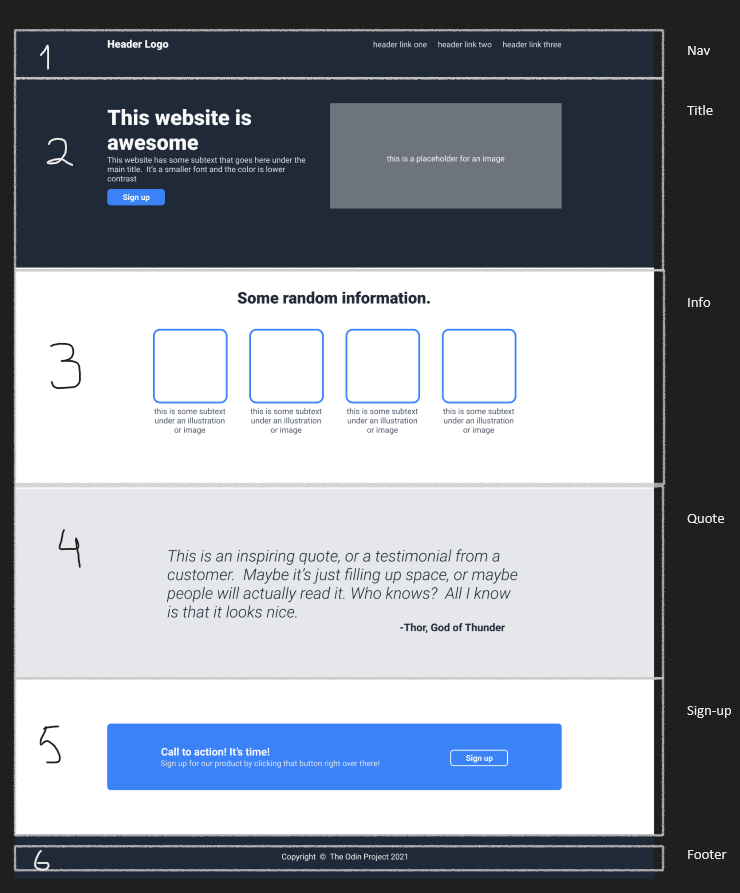
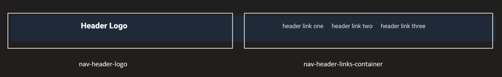
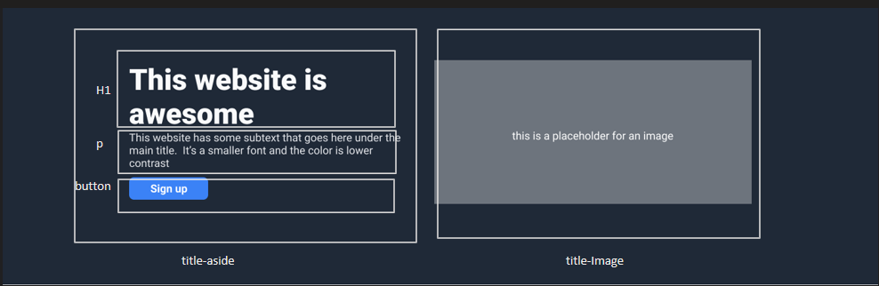
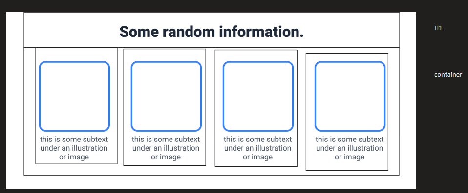
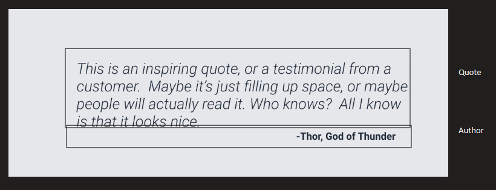

# web_first_landing_page
My first landing page using HTML and CSS

The expected output should look like this 

The text and fonts needed to finish the project are these 

## The sketch

First, let's design the skeleton. For this project, I will be using flexbox as the basis.

We need 6 elements in the first flexbox

This elements are:
* Nav
* Title
* Info
* Quote
* Sign-up
* Footer

Let's start lying the blocks

## The navigation bar

The navigation bar is composed of two flex containers.

The first container will display the logo only.

The other container will have three items for the links.

## The title section

The title section contains two elements, one for displaying the text, and another for an image.

The second container just contains the element itself.

The first element contains:

* h1 for the title
* p for the text
* a button (sign up)

## The information section 

The info section contains two elements: and h1 that displays text, and a container where images are shown.

## The quote section

The quote section contains two p elements, one for the text and the other for the author.

